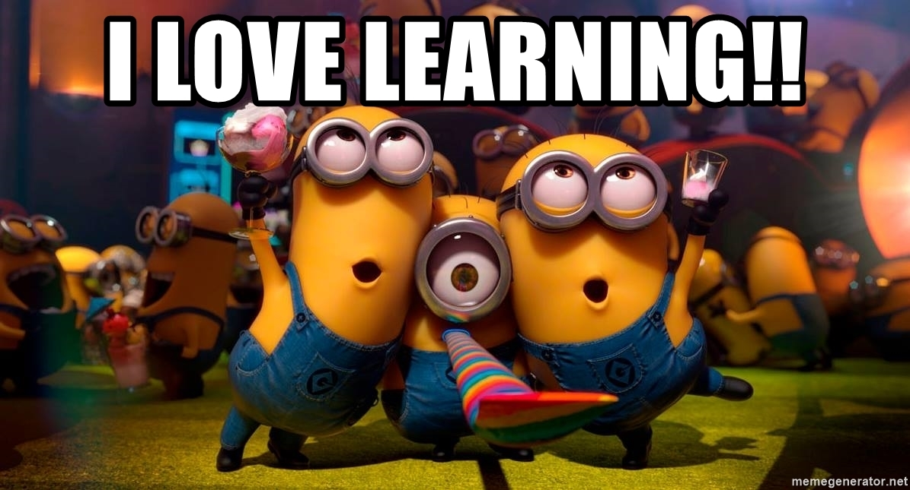

# PYTHON FOR MODEL DEPLOYMENT

The following repository contains the materials (i.e. codes and guide) for an introduction to model deployment using Python

### Materials available:

<b> |- 01_Intro_to_API_Model_Deployment.pdf </b>: Slides on the overview of APIs (theory) can be found in the [Materials](Materials) folder

<b> |- Lab02_Flask_Model_Deployment </b>

1. <b> 02_Guide_for_API_Creation.pdf </b>: Guide to explain more indepth on the API creation using Flask framework 
2. <b> requirements.txt </b>: List of packages that need to be installed before lab can be run (the packages can be installed via `pip install -r requirements.txt`)
3. <b> app.py </b>: Main app python file that contains blanks for own hands-on learning in coding out the endpoints to deploy the vader model
4. <b> app_vader_completed.py </b>: Completed version of app.py
5. <b> app_vader_bert_completed.py </b>: Completed pytohn code which deploys both bert and vader model
7. <b> static </b>: Contains static assets such as model weights and frontend css files
8. <b> templates </b>: Contains the frontend HTML file

<b> |- Lab03_Docker_Model_Deployment </b>

<b> |- Lab04_Database_Integration_Flask </b>

<i> Note For the BERT Model weights, please download them from the following [Google Drive Link](https://drive.google.com/drive/folders/1TZUOcuM29V4hq3MIjVKSAwzARJTl79sn?usp=sharing) and unzip them into the respective static/models folder in the Lab folders. </i>

 
<b> Have fun with the materials! </b>
 

